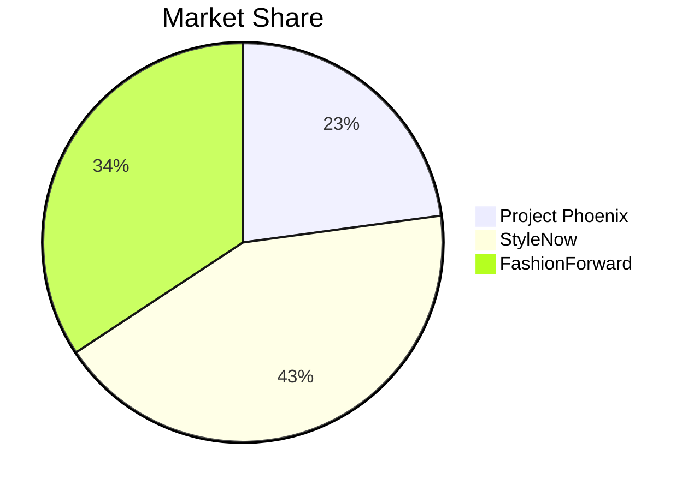
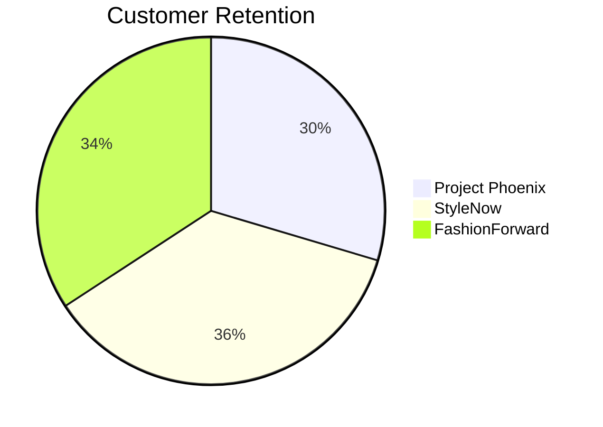
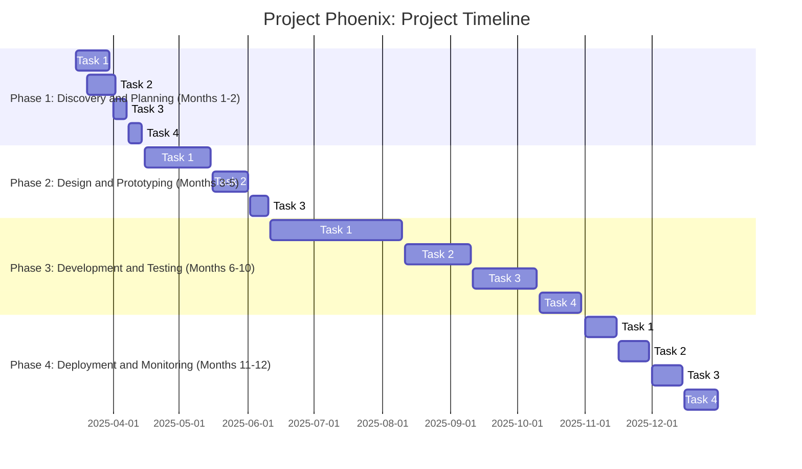
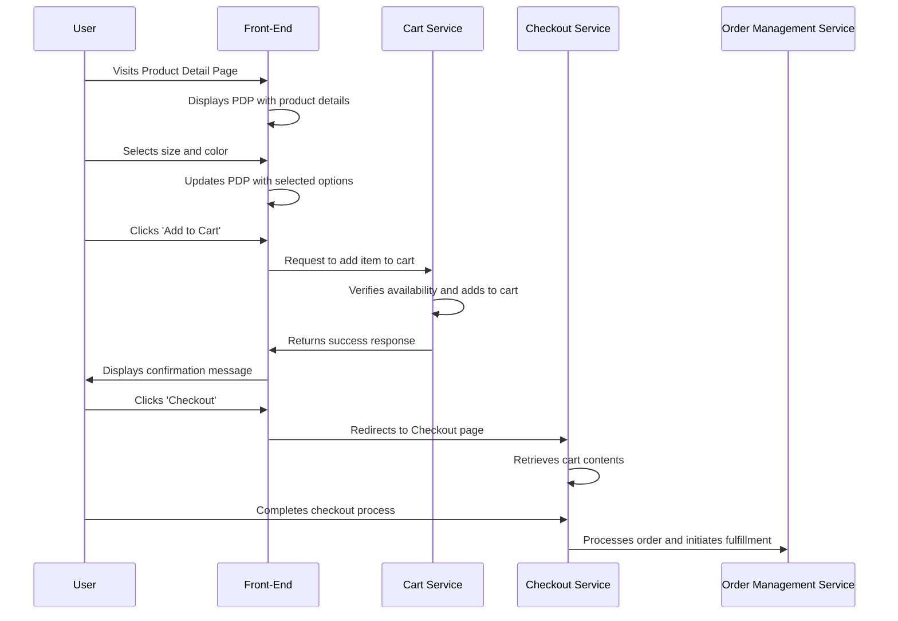

<think>
Alright, so I need to help process this document by inserting Mermaid diagrams into the appropriate sections. Let me first understand the structure of the document and where the diagrams should go.

Looking at the original documentation, it's titled "Project Phoenix: Design Document" and has several sections. The user has provided a set of diagrams, which include pie charts, a sequence diagram, and a Gantt chart. Each diagram has a summarized caption that should correspond to a specific section in the document.

First, I'll list out the sections of the document to find where each diagram fits best.

1. **Business Background**
   - 1.1 Market Context
   - 1.2 Project Rationale

2. **Project Background**
   - 2.1 Project Timeline

3. **Business Requirements**
   - 3.1 Business Process Description

4. **System Design**
   - 4.1 Interaction Sequence Design
   - 4.2 Data Flow Information
   - 4.3 Scalability and Reliability
   - 4.4 Security Considerations

5. **Deployment**
   - 5.1 Deployment Strategy
   - 5.2 Monitoring and Rollback

6. **Future Enhancements**

Now, looking at the diagrams:

- **Pie Charts**:
  - "Market Share in the Fast Fashion Segment"
  - "Customer Retention Rates"

These should go into the **Market Context** section (1.1) since they relate to market share and retention rates.

- **Sequence Diagram**:
  - "Product Addition and Checkout Sequence Diagram"

This corresponds to the **Interaction Sequence Design** section (4.1), which describes the user interaction process.

- **Gantt Chart**:
  - "Project Phoenix: Project Timeline Phases"

This should be placed in the **Project Timeline** section (2.1), which outlines the project phases.

I'll go through each section and insert the respective Mermaid diagram just after the section title, ensuring that the original content remains unchanged except for the insertion of the diagrams.

I need to make sure that the Mermaid syntax is correctly formatted and that each diagram is placed in the correct location without altering any existing content.

Let me start with the Market Context section, insert the two pie charts, then move to the Project Timeline section for the Gantt chart, and finally, in the Interaction Sequence Design section, insert the sequence diagram.

I should also ensure that the markdown formatting is correct, using triple backticks for code blocks and proper headers.

Finally, I'll review the entire document to make sure all diagrams are correctly placed and that the original content is preserved as required.
</think>

# Project Phoenix: Design Document

**Date:** February 15, 2025

## 1. Business Background

### 1.1 Market Context

The online retail market in the APAC region is experiencing exponential growth, projected to reach \$3 trillion by 2026. However, our current market share within the key demographic of 18-35-year-olds is lagging behind competitors. Specifically, our market penetration in the "fast fashion" segment is currently at 8%, while our primary competitor, "StyleNow," holds a 15% share. Another competitor, "FashionForward," commands 12%. Further analysis reveals that our conversion rate from website visit to purchase is 2.5%, compared to the industry average of 3.8%. Customer acquisition cost (CAC) is also a concern, currently sitting at \$15 per customer, which is 25% higher than the average CAC of our top two competitors. Our customer retention rate is 45%, compared to StyleNow's 55% and FashionForward's 52%. These metrics indicate a significant opportunity for growth and improvement in our market position. The low market share is attributed to several factors, including a less-than-optimal user experience on our mobile platform, a lack of personalized recommendations, and a checkout process perceived as cumbersome.

### 1.2 Project Rationale

Project Phoenix aims to address these deficiencies and capitalize on the market opportunity by completely redesigning our customer-facing e-commerce platform. This redesign will focus on improving user experience, streamlining the purchase process, and implementing a robust personalization engine. By achieving these goals, we project a significant increase in market share, conversion rates, and customer retention, ultimately driving revenue growth.

## 2. Project Background

### 2.1 Project Timeline

The project will be executed in four distinct phases, with a total estimated duration of 12 months:

*   **Phase 1: Discovery and Planning (Months 1-2):** This phase involves in-depth user research, competitive analysis, requirement gathering, and detailed project planning. Key deliverables include a comprehensive project plan, detailed user stories, and wireframes for the new platform.

*   **Phase 2: Design and Prototyping (Months 3-5):** This phase focuses on creating high-fidelity designs and interactive prototypes based on the approved wireframes. User testing will be conducted iteratively to refine the design and ensure optimal usability.

*   **Phase 3: Development and Testing (Months 6-10):** This is the core development phase, where the new platform will be built and rigorously tested. This includes front-end development, back-end development, API integrations, and comprehensive quality assurance testing.

*   **Phase 4: Deployment and Monitoring (Months 11-12):** The final phase involves deploying the new platform, migrating existing data, and closely monitoring performance. Post-launch support and ongoing optimization will be provided.

## 3. Business Requirements

### 3.1 Business Process Description

The current customer journey involves several steps, many of which present opportunities for improvement:

1.  **Discovery:** Customers discover products through various channels (social media, search engines, email marketing).
2.  **Browsing:** Customers browse the website or mobile app, viewing product details and adding items to their cart.
3.  **Checkout:** Customers proceed to checkout, entering shipping and payment information. This is a multi-step process currently.
4.  **Order Confirmation:** Customers receive an order confirmation email.
5.  **Shipping and Delivery:** Customers receive shipping updates and eventually receive their order.
6.  **Post-Purchase:** Customers may leave reviews, contact customer support, or return items.

The redesigned process aims to simplify and enhance this journey:

1.  **Unified Discovery:** Streamlined discovery across all channels, with personalized recommendations presented proactively.
2.  **Enhanced Browsing:** Improved product filtering, search functionality, and high-quality product imagery.
3.  **One-Click Checkout:** Implementation of a one-click checkout option for returning customers.
4.  **Proactive Order Updates:** Real-time order tracking and proactive notifications.
5.  **Simplified Returns:** Easy and intuitive online return process.
6.  **Personalized Engagement:** Post-purchase engagement through personalized recommendations and exclusive offers.

## 4. System Design

### 4.1 Interaction Sequence Design

The following describes a typical user interaction sequence for adding a product to the cart and proceeding to checkout:

1.  **User:** Visits the product detail page (PDP) for a specific item.
2.  **System (Front-End):** Displays the PDP, including product images, descriptions, price, and available sizes/colors.
3.  **User:** Selects a size and color.
4.  **System (Front-End):** Updates the PDP to reflect the selected options and availability.
5.  **User:** Clicks 'Add to Cart'.
6.  **System (Front-End):** Sends a request to the Cart Service to add the item to the cart.
7.  **System (Cart Service):** Verifies product availability and adds the item to the cart.
8.  **System (Cart Service):** Returns a success response.
9.  **System (Front-End):** Displays a confirmation message.
10. **User:** Clicks 'Checkout'.
11. **System (Front-End):** Redirects to the Checkout page.
12. **System (Checkout Service):** Retrieves cart contents.
13. **User:** Completes the checkout process.
14. **System (Checkout Service):** Processes the order and initiates fulfillment.

### 4.2 Data Flow Information

The system will utilize several key data flows to manage information:

*   **Product Catalog Data Flow:** Product information (name, description, images, price) will be managed by the Product Catalog Service. This service will provide an API for other services (e.g., Front-End, Search Service) to access product data. The data will flow from the Product Information Management (PIM) system to the Product Catalog Service, and then to other services as needed.

*   **User Data Flow:** User information (profile, address, payment methods) will be managed by the User Profile Service. This service will provide secure access to user data for other services (e.g., Checkout Service, Personalization Service). Data will flow from user input (registration, profile updates) to the User Profile Service, and then to other services upon request.

*   **Order Data Flow:** Order information (items, shipping address, payment details, status) will be managed by the Order Management Service. This service will interact with other services (e.g., Checkout Service, Payment Gateway) to process orders. Data will flow from the Checkout Service to the Order Management Service, and then to various downstream services for fulfillment.

*   **Inventory Data Flow:** Real-time inventory levels will be managed by the Inventory Service. This service will receive updates from the warehouse management system and provide this information to the Product Catalog Service and Cart Service. Data will flow from the warehouse management system to the Inventory Service, and then to other services to ensure accurate product availability information.

*   **Personalization Data Flow:** User behavior data (browsing history, purchase history, wishlists) will be collected and processed by the Personalization Service. This service will use this data to generate personalized recommendations and offers. Data will flow from user interactions on the website/app to the Personalization Service, which will then provide recommendations to the Front-End for display.

These data flows will be implemented using a combination of synchronous and asynchronous communication patterns, leveraging APIs and message queues to ensure scalability and reliability.

## 5. System Architecture

### 5.1 Interaction Sequence Design

The following describes a typical user interaction sequence for adding a product to the cart and proceeding to checkout:

1.  **User:** Visits the product detail page (PDP) for a specific item.
2.  **System (Front-End):** Displays the PDP, including product images, descriptions, price, and available sizes/colors.
3.  **User:** Selects a size and color.
4.  **System (Front-End):** Updates the PDP to reflect the selected options and availability.
5.  **User:** Clicks 'Add to Cart'.
6.  **System (Front-End):** Sends a request to the Cart Service (Back-End) to add the item to the user's cart.
7.  **System (Cart Service):** Verifies product availability and adds the item to the user's cart in the database.
8.  **System (Cart Service):** Returns a success response to the Front-End.
9.  **System (Front-End):** Displays a confirmation message to the user (e.g., "Item added to cart").
10. **User:** Clicks the 'Checkout' button.
11. **System (Front-End):** Redirects the user to the Checkout page.
12. **System (Checkout Service):** Retrieves the user's cart contents and pre-populates checkout fields (if the user is logged in).
13. **User:** Completes the checkout process (or uses one-click checkout).
14. **System (Checkout Service):** Processes the order and sends a request to the Order Management Service.
15. **System (Order Management Service):** Creates a new order record in the database and initiates the fulfillment process.

### 4.2 Data Flow Information

The system will utilize several key data flows to manage information:

*   **Product Catalog Data Flow:** Product information (name, description, images, price) will be managed by the Product Catalog Service. This service will provide an API for other services (e.g., Front-End, Search Service) to access product data. The data will flow from the Product Information Management (PIM) system to the Product Catalog Service, and then to other services as needed.

*   **User Data Flow:** User information (profile, address, payment methods) will be managed by the User Profile Service. This service will provide secure access to user data for other services (e.g., Checkout Service, Personalization Service). Data will flow from user input (registration, profile updates) to the User Profile Service, and then to other services upon request.

*   **Order Data Flow:** Order information (items, shipping address, payment details, status) will be managed by the Order Management Service. This service will interact with other services (e.g., Checkout Service, Payment Gateway) to process orders. Data will flow from the Checkout Service to the Order Management Service, and then to various downstream services for fulfillment and tracking.

*   **Inventory Data Flow:** Real-time inventory levels will be managed by the Inventory Service. This service will receive updates from the warehouse management system and provide this information to the Product Catalog Service and Cart Service. Data will flow from the warehouse management system to the Inventory Service, and then to other services to ensure accurate product availability information.

*   **Personalization Data Flow:** User behavior data (browsing history, purchase history, wishlists) will be collected and processed by the Personalization Service. This service will use this data to generate personalized recommendations and offers. Data will flow from user interactions on the website/app to the Personalization Service, which will then provide recommendations to the Front-End for display.

These data flows will be implemented using a combination of synchronous and asynchronous communication patterns, leveraging APIs and message queues to ensure scalability and reliability.

## 5. System Architecture

### 5.1 Microservices Architecture

The system will be designed using a microservices architecture. This approach offers several benefits, including scalability, maintainability, and fault isolation. Key microservices include:

*   **Product Catalog Service:** Manages product information (details, images, pricing).
*   **User Profile Service:** Manages user accounts, profiles, and preferences.
*   **Cart Service:** Manages user shopping carts.
*   **Checkout Service:** Handles the checkout process, including payment and shipping.
*   **Order Management Service:** Manages order fulfillment, tracking, and returns.
*   **Inventory Service:** Tracks real-time inventory levels.
*   **Search Service:** Provides search functionality across the product catalog.
*   **Personalization Service:** Generates personalized recommendations and offers.
*   **Payment Gateway Service:** Integrates with third-party payment providers.
*   **Shipping Service:** Integrates with shipping carriers.
*   **Notification Service:** Sends email and push notifications to users.

### 4.3 Scalability and Reliability

The system will be designed for high scalability and reliability, leveraging the capabilities of AWS. Key strategies include:

*   **Horizontal Scaling:** Microservices will be deployed across multiple instances to handle increased traffic.
*   **Load Balancing:** API Gateway and load balancers will distribute traffic evenly across instances.
*   **Database Replication:** Database replication will ensure data availability and fault tolerance.
*   **Caching:** Redis will be used to cache frequently accessed data, reducing database load.
*   **Asynchronous Processing:** Message queues (Kafka) will be used for asynchronous tasks, such as sending notifications and processing orders.
*   **Monitoring and Alerting:** Comprehensive monitoring and alerting will be implemented to detect and respond to issues proactively.

### 4.4 Security Considerations

Security will be a top priority throughout the design and development process. Key security measures include:

*   **Authentication and Authorization:** Secure authentication and authorization mechanisms will be implemented to protect user data.
*   **Data Encryption:** Data will be encrypted both in transit (using HTTPS) and at rest.
*   **Input Validation:** All user inputs will be validated to prevent injection attacks.
*   **Regular Security Audits:** Regular security audits and penetration testing will be conducted.
*   **Compliance:** The system will be designed to comply with relevant data privacy regulations (e.g., GDPR, CCPA).
*   **Role-Based Access Control (RBAC):** Implementing RBAC to restrict access to sensitive data and functionalities based on user roles.

## 5. Deployment

### 5.1 Deployment Strategy

A phased rollout strategy will be used to minimize disruption and allow for early feedback:

1.  **Internal Beta:** The new platform will first be launched internally to a small group of employees for testing and feedback.
2.  **Limited External Beta:** A small group of external users will be invited to participate in a beta program.
3.  **Phased Rollout by Region:** The platform will be rolled out to different geographic regions gradually.
4.  **Full Launch:** Once the platform is stable and performing well, it will be launched to all users.

### 5.2 Monitoring and Rollback

Throughout the deployment process, key performance indicators (KPIs) will be closely monitored. These include:

*   Website traffic and conversion rates
*   Order processing time
*   System performance (response time, error rates)
*   Customer satisfaction (through surveys and feedback)

A rollback plan will be in place to revert to the previous system if any critical issues are encountered.

## 6. Future Enhancements

Following the initial launch, several enhancements are planned:

*   **Advanced Personalization:** Implement more sophisticated personalization algorithms, including AI-powered recommendations.
*   **Visual Search:** Allow users to search for products using images.
*   **Augmented Reality (AR) Features:** Integrate AR features to allow users to virtually "try on" products.
*   **Social Commerce Integration:** Integrate with social media platforms to enable seamless shopping experiences.
*   **Expansion to New Markets:** Expand the platform to support additional languages and currencies.

This document provides a high-level overview of Project Phoenix. Detailed specifications for each component will be developed during the subsequent phases of the project.